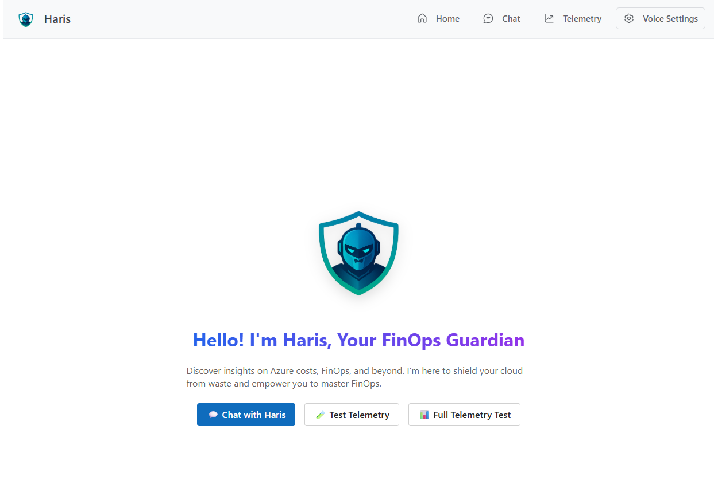
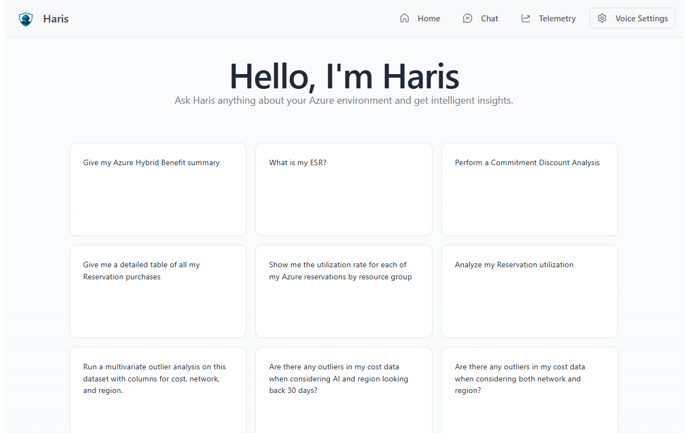
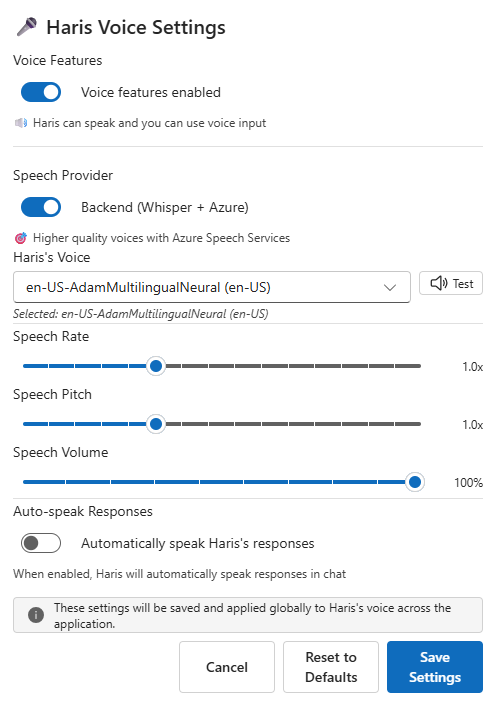

# Haris UI - AI-Powered Chat Interface

A sophisticated React application with TypeScript, Vite, and Microsoft Fluent UI, featuring AI-powered chat capabilities and comprehensive Azure integration. Optimized for deployment on Azure Container Apps with fast provisioning (~2-3 minutes) and comprehensive Application Insights monitoring.

## ✨ Features

- **🤖 AI Chat Interface**: Interactive chat with multiple AI agents
- **📊 Data Visualization**: Chart display components for data insights  
- **🎨 Modern UI**: Microsoft Fluent UI components with light theme
- **📱 Responsive Design**: Mobile-friendly navigation and layouts
- **🔍 Citation Handling**: Smart citation processing and display
- **📈 Real-time Telemetry**: Application Insights integration
- **⚡ Fast Deployment**: Image upsert technique for rapid provisioning
- **🔄 Auto-scaling**: Azure Container Apps with HTTP-based scaling




<video controls src="harisdemo.mp4" title="Title"></video>

## 🚀 Quick Start

### Prerequisites

- **Node.js 18+**: For local development
- **Azure Developer CLI (azd)**: For deployment (`winget install microsoft.azd`)
- **Docker**: For containerization (optional for local dev)
- **Azure Subscription**: For cloud deployment

### 1️⃣ First Time Deployment

**IMPORTANT: Start Docker Desktop first!**

Open VS Code terminal (`Ctrl+` backtick) and run:

```powershell
# 1. Start Docker/Rancher Desktop (if not running)
# For Docker Desktop:
Start-Process "C:\Program Files\Docker\Docker\Docker Desktop.exe"

# Wait 2-3 minutes for Docker daemon to fully initialize
# Test with: docker version

# 2. Authenticate with Azure
azd auth login

# 3. Initialize project (if not done)
azd init

# 4. Deploy everything
azd up
```

**Follow prompts:**
- Environment name: `haris-dev`
- Subscription: [Select yours]
- Location: `East US 2`

### 2️⃣ Using VS Code Tasks (Easier!)

Press `Ctrl+Shift+P` then type:
```
Tasks: Run Task
```
Select: `Azure: Deploy to Container Apps`

### 3️⃣ Code-Only Updates (Fast!)

```powershell
# Deploy code changes only
azd deploy
```

Or use VS Code task:
```
Ctrl+Shift+P → Tasks: Run Task → Azure: Deploy Application Only
```

### Local Development

```bash
# Install dependencies
npm install

# Start development server (with hot reload)
npm run dev

# Build for production
npm run build

# Preview production build
npm run preview

# Run linting
npm run lint
```

### Environment Setup

Create a `.env.production` file for Application Insights:

```bash
VITE_APPINSIGHTS_CONNECTION_STRING=your-connection-string-here
```

## ☁️ Azure Deployment

This project uses an **optimized deployment strategy** with placeholder images for fast provisioning (~2 minutes vs 10+ minutes).

### 🎯 Deploy to Azure (Recommended)

1. **Login to Azure**:
   ```bash
   azd auth login
   ```

2. **Deploy with optimized strategy**:
   ```bash
   # Fast deployment with placeholder image strategy
   azd up
   ```

3. **Subsequent updates**:
   ```bash
   # Deploy only application changes (29 seconds)
   azd deploy
   
   # Update infrastructure if needed
   azd provision
   ```

## 💻 VS Code Deployment (Recommended for Development)

### Install Required VS Code Extensions

Open VS Code Extensions panel (`Ctrl+Shift+X`) and install:

1. **Azure Developer CLI** (Microsoft)
2. **Azure Account** (Microsoft)
3. **Azure Resources** (Microsoft)
4. **Azure Container Apps** (Microsoft)
5. **Bicep** (Microsoft)
6. **Docker** (Microsoft)

### Deploy Using VS Code Tasks

**Method A: Using Command Palette**
1. Press `Ctrl+Shift+P`
2. Type: `Tasks: Run Task`
3. Select: `Azure: Deploy to Container Apps`

**Method B: Using Built-in Tasks**
- `Azure: Deploy to Container Apps` - Full deployment
- `Azure: Deploy Application Only` - Code updates only
- `Azure: Provision Infrastructure Only` - Infrastructure only
- `Build: React Application` - Local build test
- `Azure: View Logs` - Stream logs

### Daily Development Workflow

1. **Make changes** in VS Code
2. **Test locally**: `npm run dev`
3. **Deploy**: `Ctrl+Shift+P` → `Tasks: Run Task` → `Azure: Deploy Application Only`
4. **Check app**: Visit your application URL

## 🤖 GitHub Actions CI/CD

Automate your deployments with GitHub Actions! Choose from three setup approaches.

### 🎯 Azure Developer CLI Pipeline Setup (Recommended)

The easiest way to set up GitHub Actions with OIDC authentication and federated credentials:

```bash
# Configure GitHub pipeline with azd
azd pipeline config
```

**What this command does**:
1. **Creates GitHub workflow**: Generates `.github/workflows/azure-dev.yml`
2. **Sets up OIDC authentication**: Creates federated credentials (no stored secrets!)
3. **Creates Managed Identity**: Provisions `msi-<project-name>` with proper permissions
4. **Configures GitHub variables**:
   - `AZURE_CLIENT_ID` - Managed identity client ID
   - `AZURE_TENANT_ID` - Your Azure tenant ID
   - `AZURE_SUBSCRIPTION_ID` - Target subscription
   - `AZURE_LOCATION` - Deployment region
   - `AZURE_ENV_NAME` - Environment name

**Step-by-step process**:
1. You'll be prompted to authenticate with GitHub CLI
2. Choose **"Federated User Managed Identity (MSI + OIDC)"** for secure authentication
3. Select **"Create new User Managed Identity"** or use existing
4. Pick your preferred Azure region and resource group
5. AZD automatically configures all GitHub repository variables

**Benefits**:
- ✅ **No secrets stored** - uses OIDC federated credentials
- ✅ **Automatic setup** - configures everything in one command
- ✅ **Enterprise security** - follows Microsoft best practices
- ✅ **Fast deployment** - includes image upsert optimization
- ✅ **Production ready** - includes error handling and monitoring

### �️ Alternative: Manual Setup

If you prefer manual configuration or need custom settings:

1. **Create User-Assigned Managed Identity** in Azure Portal
2. **Set up Federated Credentials** for your GitHub repository
3. **Configure GitHub Variables** manually:
   ```bash
   gh variable set AZURE_CLIENT_ID --body "your-client-id"
   gh variable set AZURE_TENANT_ID --body "your-tenant-id"
   gh variable set AZURE_SUBSCRIPTION_ID --body "your-subscription-id"
   gh variable set AZURE_LOCATION --body "your-region"
   gh variable set AZURE_ENV_NAME --body "your-env-name"
   ```
4. **Create workflow file** at `.github/workflows/azure-dev.yml`

### � Pipeline Configuration Troubleshooting

**Common issues with `azd pipeline config`**:

```bash
# Issue: GitHub CLI not authenticated
azd pipeline config
# Solution: Follow the GitHub authentication prompts

# Issue: Missing GitHub variables
gh variable list
# Solution: Manually set missing variables:
gh variable set AZURE_LOCATION --body "eastus2"
gh variable set AZURE_SUBSCRIPTION_ID --body "your-subscription-id"

# Issue: Workflow fails with authentication errors
# Solution: Check federated credentials in Azure Portal:
# Azure AD > App registrations > msi-<project-name> > Certificates & secrets > Federated credentials

# Issue: Pipeline timeout or resource conflicts
# Solution: Clean up failed deployments:
azd down --purge --force
```

**Verify your setup**:
```bash
# Check GitHub variables are set
gh variable list

# Test the workflow manually
gh workflow run azure-dev.yml

# Check workflow status
gh run list --workflow=azure-dev.yml
```

### �🔄 Workflow Features

- **Automatic builds** on every push to main
- **Infrastructure provisioning** with first-time bootstrap
- **Application Insights telemetry** automatically configured
- **Fast deployments** using Azure Developer CLI (~45 seconds)
- **Security** with Azure OIDC authentication

### 📊 Deployment Performance
- **Infrastructure Provisioning**: ~1-2 minutes (with placeholder image)
- **Application Build**: ~30-45 seconds (React + Docker)
- **Container Update**: ~15 seconds (image upsert)
- **Total Time**: ~2-3 minutes (70-80% faster than traditional approach)

### 📁 Key Configuration Files
- **`azure.yaml`** - Azure Developer CLI configuration with image upsert strategy
- **`infra/main.bicep`** - Infrastructure as Code using Azure Verified Modules
- **`.github/workflows/azure-dev.yml`** - GitHub Actions CI/CD pipeline
- **`Dockerfile`** - Multi-stage container build with nginx
- **`package.json`** - Dependencies and build scripts
- **`.env.example`** - Key environment variables file

## 🏗️ Architecture

### Azure Resources Created
- **Container App**: Hosts the React application with auto-scaling
- **Container Registry**: Stores Docker images securely with managed identity access
- **Application Insights**: Real-time performance monitoring and error tracking
- **Log Analytics Workspace**: Centralized logging and metrics
- **Container Apps Environment**: Serverless container platform with consumption pricing
- **User-Assigned Managed Identity**: Secure, passwordless resource access

### 🔄 Image Upsert Deployment Strategy
1. **Phase 1 (Provision)**: Infrastructure deploys with lightweight placeholder image (`mcr.microsoft.com/azuredocs/containerapps-helloworld:latest`)
2. **Phase 2 (Build)**: Custom React application builds in parallel
3. **Phase 3 (Deploy)**: Seamless container update to production application

**Performance**: ~3-7 minutes total

## 📈 Monitoring & Observability

### Application Insights Integration
- **Performance Monitoring**: Page load times, response times
- **Error Tracking**: JavaScript errors and exceptions  
- **User Analytics**: Usage patterns and flows
- **Custom Telemetry**: Business metrics and events

### Log Analytics
- **Container Logs**: Application output and errors
- **System Metrics**: CPU, memory, and scaling events
- **Security Logs**: Access and authentication events

### Log Analytics

- **Container Logs**: Application output and errors
- **System Metrics**: CPU, memory, and scaling events
- **Security Logs**: Access and authentication events

## 🛠️ Development

### Tech Stack

**Frontend Framework**:
- **React 18** + **TypeScript** + **Vite 6** - Modern development stack
- **Microsoft Fluent UI** - Professional UI components and theming
- **React Router DOM** - Client-side routing and navigation

**Core Dependencies**:
- **Application Insights** - Real-time telemetry and monitoring
- **Axios** - HTTP client for API communication
- **React Markdown** - Markdown rendering with syntax highlighting
- **Lodash** - Utility functions for data manipulation

**Development Tools**:
- **ESLint 9** - Code quality and consistency
- **TypeScript 5.7** - Type safety and developer experience
- **Vite HMR** - Fast hot module replacement

**Infrastructure**:
- **Azure Bicep** - Infrastructure as Code
- **Azure Verified Modules** - Enterprise-grade resource templates
- **Docker** - Multi-stage containerization
- **Azure Container Apps** - Serverless container hosting

### Project Structure
```
src/
├── api/           # API integration (harisApi.ts)
├── components/    # Reusable UI components
│   ├── ChatWindow/     # Chat interface components
│   ├── ChartDisplay/   # Data visualization
│   ├── CitationHandler/# Citation processing
│   └── NavBar/         # Navigation component
├── pages/         # Route components (Chat, HomePage)
├── hooks/         # Custom React hooks (useAgentChat)
├── utils/         # Utility functions (citationUtils)
├── constants/     # Configuration (agents.ts)
└── assets/        # Static assets
```

### ESLint Configuration

For production applications, enable type-aware lint rules:

```js
export default tseslint.config({
  extends: [
    ...tseslint.configs.recommendedTypeChecked,
    ...tseslint.configs.strictTypeChecked,
  ],
  languageOptions: {
    parserOptions: {
      project: ['./tsconfig.node.json', './tsconfig.app.json'],
      tsconfigRootDir: import.meta.dirname,
    },
  },
})
```

## 🔧 Troubleshooting

### Common Issues and Solutions

#### 1. **Docker not running**

```powershell
# If using Docker Desktop:
Start-Process "C:\Program Files\Docker\Docker\Docker Desktop.exe"

# If using Rancher Desktop:
Start-Process "C:\Program Files\Rancher Desktop\Rancher Desktop.exe"

# Wait 2-3 minutes, then check:
docker version
```

#### 2. **Container App Won't Start**

```bash
# Check container logs
az containerapp logs show --name <app-name> --resource-group <rg-name>

# Check revision status
az containerapp revision list --name <app-name> --resource-group <rg-name>
```

#### 3. **Authentication Issues**

```powershell
# Re-authenticate Azure CLI
az login

# Re-authenticate Azure Developer CLI
azd auth login
```

#### 4. **Build Failures**

```bash
# Clear npm cache
npm cache clean --force

# Rebuild node_modules
rm -rf node_modules package-lock.json
npm install

# Check Docker build locally
docker build -t haris-ui:test .
```

#### 5. **ACR Authentication Errors**

```bash
# Verify managed identity role assignment
az role assignment list --assignee <identity-principal-id> --scope <acr-resource-id>

# Check container app managed identity
az containerapp show --name <app-name> --resource-group <rg-name> --query "identity"
```

#### 6. **Deployment Stuck in Progress**

```bash
# Check provisioning status
azd provision --preview

# Apply pending changes
azd provision

# Force refresh infrastructure
azd provision --force
```

### Performance Optimization Tips

1. **Fast Deployments**: Use `azd deploy` for code-only updates
2. **Monitoring**: Check Application Insights for performance bottlenecks
3. **Scaling**: Container Apps auto-scale based on HTTP requests
4. **Caching**: Leverage Azure CDN for static assets (if needed)

### Useful Commands

```bash
# Get application URL
azd show

# View environment variables  
azd env get-values

# Stream live logs
az containerapp logs tail --name <app-name> --resource-group <rg-name>

# Check container app status
az containerapp show --name <app-name> --resource-group <rg-name> --query "properties.provisioningState"

# Force refresh infrastructure
azd provision --force

# Clean up all resources
azd down --force --purge
```

## 📚 Additional Resources

### Azure Resources
- [Azure Container Apps Documentation](https://docs.microsoft.com/en-us/azure/container-apps/)
- [Azure Developer CLI Documentation](https://docs.microsoft.com/en-us/azure/developer/azure-developer-cli/)
- [Azure Verified Modules](https://azure.github.io/Azure-Verified-Modules/)
- [Application Insights for React](https://docs.microsoft.com/en-us/azure/azure-monitor/app/javascript-react-plugin)

### Development Resources
- [Microsoft Fluent UI Documentation](https://react.fluentui.dev/)
- [Vite Documentation](https://vitejs.dev/)
- [React 18 Documentation](https://react.dev/)

## 🚀 Quick Commands Reference

| What you want to do | Command | VS Code Task |
|---------------------|---------|-------------|
| First deploy | `azd up` | `Azure: Deploy to Container Apps` |
| Update code | `azd deploy` | `Azure: Deploy Application Only` |
| Infrastructure only | `azd provision` | `Azure: Provision Infrastructure Only` |
| View logs | `azd monitor --logs` | `Azure: View Logs` |
| Check status | `azd show` | - |
| Build locally | `npm run build` | `Build: React Application` |
| Local dev server | `npm run dev` | - |
| Stream live logs | `az containerapp logs tail --name <app> --resource-group <rg> --follow` | - |

## 🤝 Contributing

1. **Fork the repository**
2. **Create a feature branch**
3. **Make your changes**
4. **Test deployment** with `azd up`
5. **Submit a pull request**

## 📄 License

This project is licensed under the MIT License - see the [LICENSE](LICENSE) file for details.

---

**🎯 Ready to deploy?** Start with the Quick Start section above!

**Live Application**: Deployed on Azure Container Apps with 99.9% uptime SLA, auto-scaling, and global distribution.
